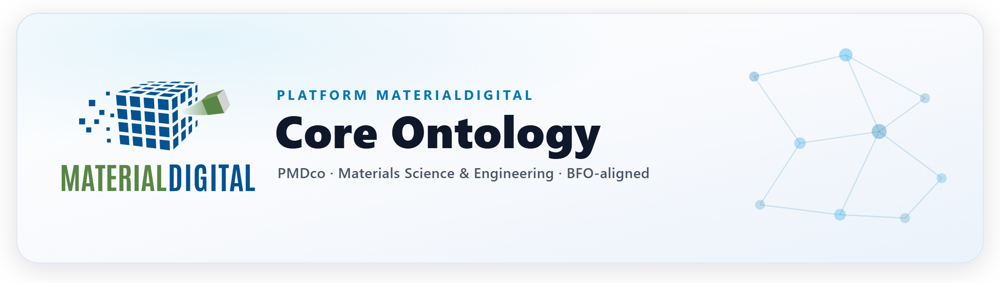

<div align="center">



<br><br>

[](https://github.com/materialdigital/core-ontology/actions/workflows/abox_conventions_shacl.yaml)
[](https://github.com/materialdigital/core-ontology/actions/workflows/quality-checks.yaml)
[](https://github.com/materialdigital/core-ontology/releases)
[](https://doi.org/10.1016/j.matdes.2023.112603)


<strong>
<a href="https://materialdigital.github.io/core-ontology/docs/">Documentation</a>
&nbsp;·&nbsp;
<a href="https://materialdigital.github.io/core-ontology/">Class Reference</a>
&nbsp;·&nbsp;
<a href="https://github.com/materialdigital/core-ontology/tree/main/patterns">Patterns</a>
&nbsp;·&nbsp;
<a href="https://github.com/materialdigital/core-ontology/discussions">Discussions</a>
&nbsp;·&nbsp;
<a href="https://github.com/materialdigital/core-ontology/issues">Issues</a>
</strong>

</div>

<br>

The **Platform MaterialDigital Core Ontology (PMDco)** is a mid-level semantic framework for Materials Science and Engineering (MSE). Aligning with the ISO/IEC 21838-2:2021 standard, PMDco is built on the *Basic Formal Ontology (BFO)* and reuses several BFO-aligned ontologies such as **RO**, **IAO**, and **OBI**. Its scope follows the fundamental paradigm of MSE — **processing, structure, and properties** — and provides general semantics for entities commonly required across MSE disciplines, such as devices, roles, functions, and plans.

<table>
<tr>
<td width="33%" valign="top" align="center">
<br>
<strong>Processes</strong>
<br><br>
<sub>MSE-related process chains, including materials manufacturing, characterization, and simulation processes.</sub>
<br><br>
</td>
<td width="33%" valign="top" align="center">
<br>
<strong>Structure &amp; State</strong>
<br><br>
<sub>Substances, engineered materials, their composition, and multiscale structural features.</sub>
<br><br>
</td>
<td width="33%" valign="top" align="center">
<br>
<strong>Properties</strong>
<br><br>
<sub>Material properties and qualities, representing processing–structure–property dependences.</sub>
<br><br>
</td>
</tr>
</table>

<br>

## Ontology Versions

Each variant is published in both `.owl` and `.ttl` serializations. Pick the smallest one that covers your needs.

| Variant | Description | Best for |
| :--- | :--- | :--- |
| **`pmdco-minimal`** | Lightweight minimal version with the essential class skeleton ([#121](https://github.com/materialdigital/core-ontology/issues/121)). | Quick onboarding &amp; beginners |
| **`pmdco-simple`** | Simplified version with basic subclass and existential axioms. | Lightweight applications |
| **`pmdco-base`** | Core entities without extended imports. | Building application ontologies |
| **`pmdco-full`** | Complete ontology with all imports and full axiomatization. | Reasoning &amp; full inference |
| **`pmdco`** | Main ontology file — contains the full version. | General use |

<br>

## Repository Structure

This repository provides the modular implementation of PMDco, developed and maintained with the [Ontology Development Kit (ODK)](https://github.com/INCATools/ontology-development-kit).

<details>
<summary><strong>Browse the layout</strong></summary>

<br>

```text
core-ontology/
├─ src/ontology/         Main development folder, generated and managed through ODK
│  ├─ components/        Modular ontology components (classes, properties, axioms)
│  └─ pmdco-edit.owl     Primary editable ontology used during development
├─ patterns/            Logical patterns and SHACL shapes for consistent design
├─ docs/                Documentation sources for the website and user guides
├─ .github/             CI workflows and issue/PR templates
├─ mkdocs.yaml          Configuration for building the documentation site
└─ README · LICENSE · CONTRIBUTING
```

</details>

<br>

## Documentation &amp; Resources

The **[PMDco documentation site](https://materialdigital.github.io/core-ontology/docs/)** gives a clear overview of the core concepts, modules, and design principles — how PMDco is structured, how to apply it in real-world MSE data workflows, and how the components relate, with detailed explanations, examples, patterns, and release information.

<table>
<tr>
<td width="50%" valign="top">
<br>
<strong><a href="https://materialdigital.github.io/core-ontology/docs/">Documentation Site</a></strong>
<br>
<sub>Concepts, modules, design principles, examples, and release notes.</sub>
<br><br>
</td>
<td width="50%" valign="top">
<br>
<strong><a href="https://materialdigital.github.io/core-ontology/">Class &amp; Property Reference</a></strong>
<br>
<sub>Widoco-generated full listing of all classes and properties.</sub>
<br><br>
</td>
</tr>
<tr>
<td width="50%" valign="top">
<strong><a href="https://matportal.org/ontologies/PMDCO">PMDco in MatPortal</a></strong>
<br>
<sub>Browse, search, and download from the materials ontology portal.</sub>
<br><br>
</td>
<td width="50%" valign="top">
<strong><a href="https://materialdigital.github.io/core-ontology/docs/publications.html">Publications</a></strong>
<br>
<sub>Peer-reviewed publications related to PMDco.</sub>
<br><br>
</td>
</tr>
</table>

<br>

## Contributing

We welcome contributions to the Platform MaterialDigital Core Ontology — here is how to get involved.

<table>
<tr>
<td width="50%" valign="top">
<br>
<strong>Request terms or report issues</strong>
<br>
<sub>Use the <a href="https://github.com/materialdigital/core-ontology/issues">issue tracker</a> to request new terms or classes, or to report errors and concerns about the ontology.</sub>
<br><br>
</td>
<td width="50%" valign="top">
<br>
<strong>Build application ontologies</strong>
<br>
<sub>Start from the <a href="https://github.com/materialdigital/application-ontology-template/">application-ontology-template</a>, which applies the same framework and mirrors PMDco with all its modules.</sub>
<br><br>
</td>
</tr>
<tr>
<td width="50%" valign="top">
<strong>Join the discussion</strong>
<br>
<sub>Share modeling concerns or other discussable topics in the <a href="https://github.com/materialdigital/core-ontology/discussions">discussion forum</a>.</sub>
<br><br>
</td>
<td width="50%" valign="top">
<strong>PMD Playground meetings</strong>
<br>
<sub>Our online Ontology Playground runs every second Friday, 1–2 pm CET. Register via the <a href="https://www.lists.kit.edu/sympa/subscribe/ontology-playground?previous_action=info">mailing list</a>.</sub>
<br><br>
</td>
</tr>
</table>

Please also read our [Contributing guidelines](CONTRIBUTING.md) and [Code of Conduct](CODE_OF_CONDUCT.md). Need more information? Reach us at **[info@material-digital.de](mailto:info@material-digital.de)**.

<br>

## How to Cite

If you use PMDco in your work, please cite the peer-reviewed article.

> Bayerlein, B., Schilling, M., Birkholz, H., Jung, M., Waitelonis, J., Mädler, L., &amp; Sack, H. (2024). **PMD Core Ontology: Achieving semantic interoperability in materials science.** *Materials &amp; Design*, 237, 112603. https://doi.org/10.1016/j.matdes.2023.112603

<details>
<summary><strong>BibTeX</strong></summary>

```bibtex
@article{bayerlein2024pmdco,
  title   = {PMD Core Ontology: Achieving semantic interoperability in materials science},
  author  = {Bayerlein, Bernd and Schilling, Markus and Birkholz, Henk and Jung, Matthias
             and Waitelonis, J\"org and M\"adler, Lutz and Sack, Harald},
  journal = {Materials \& Design},
  volume  = {237},
  pages   = {112603},
  year    = {2024},
  doi     = {10.1016/j.matdes.2023.112603}
}
```

</details>

<br>

<div align="center">
<sub>Maintained by the <a href="https://www.material-digital.de/">Platform MaterialDigital</a> community &nbsp;·&nbsp; Licensed under <a href="LICENSE.txt">CC BY 4.0</a></sub>
</div>
