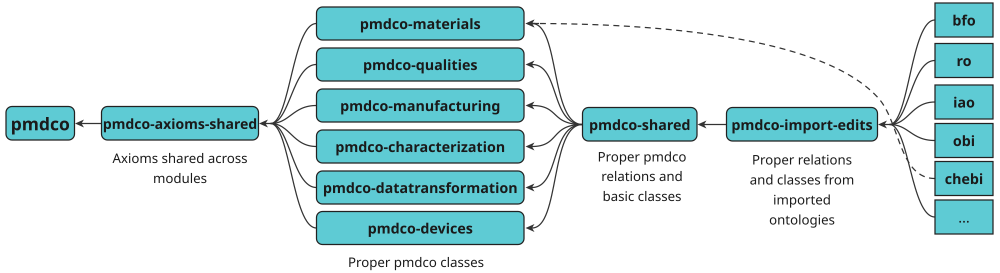
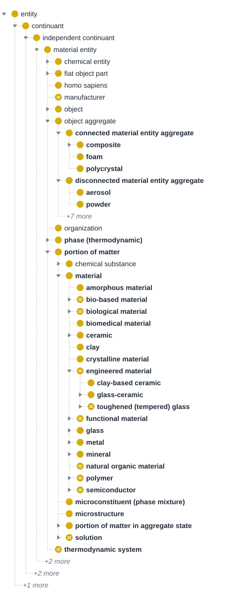
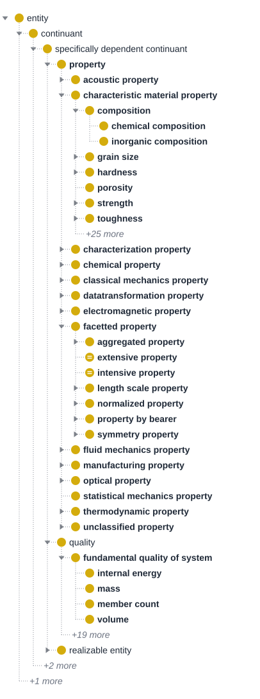
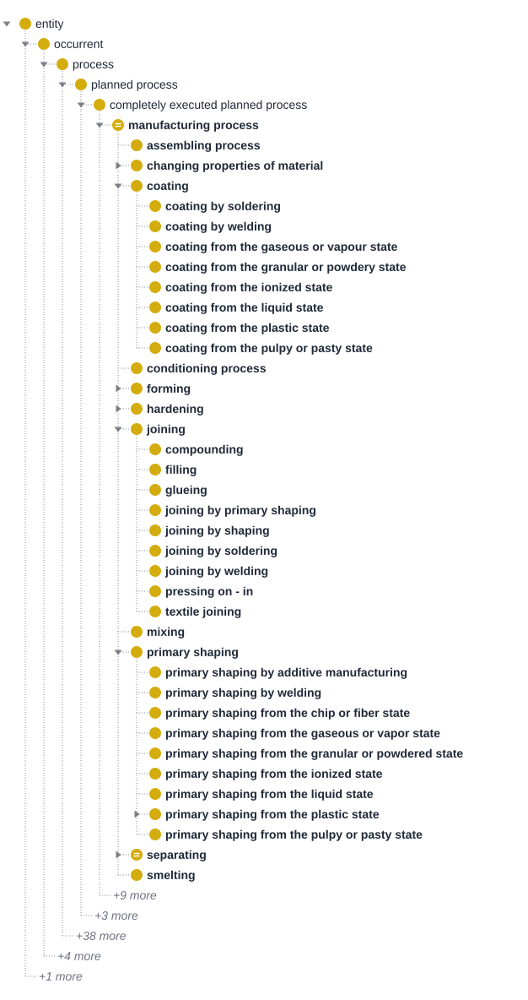
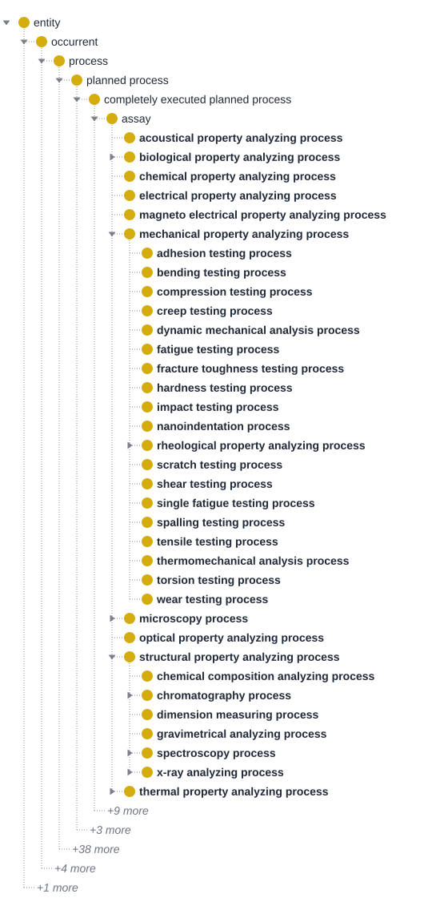
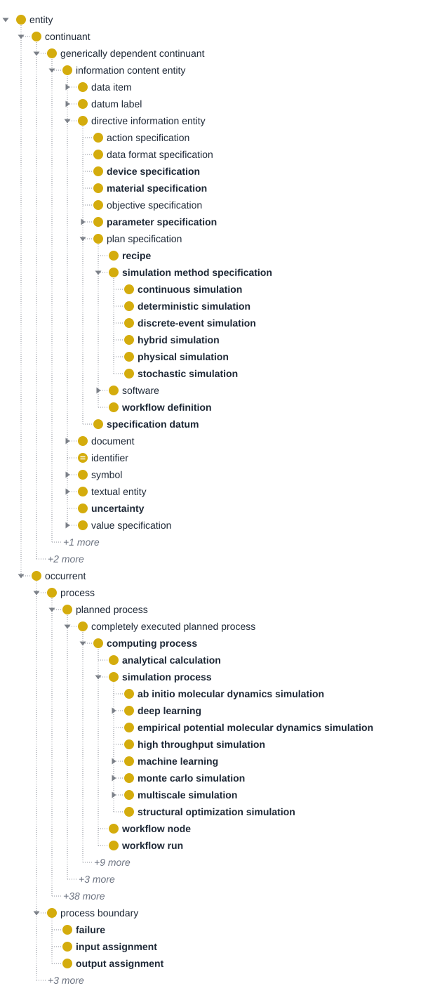
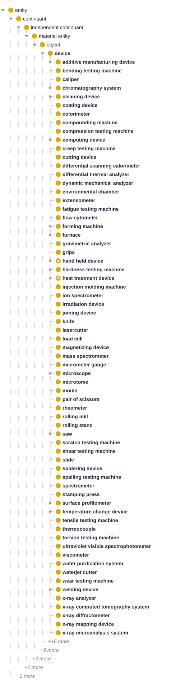
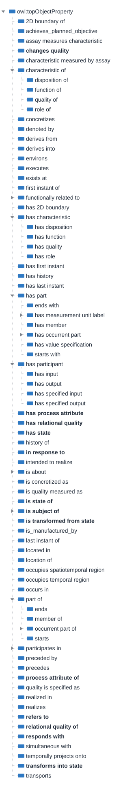
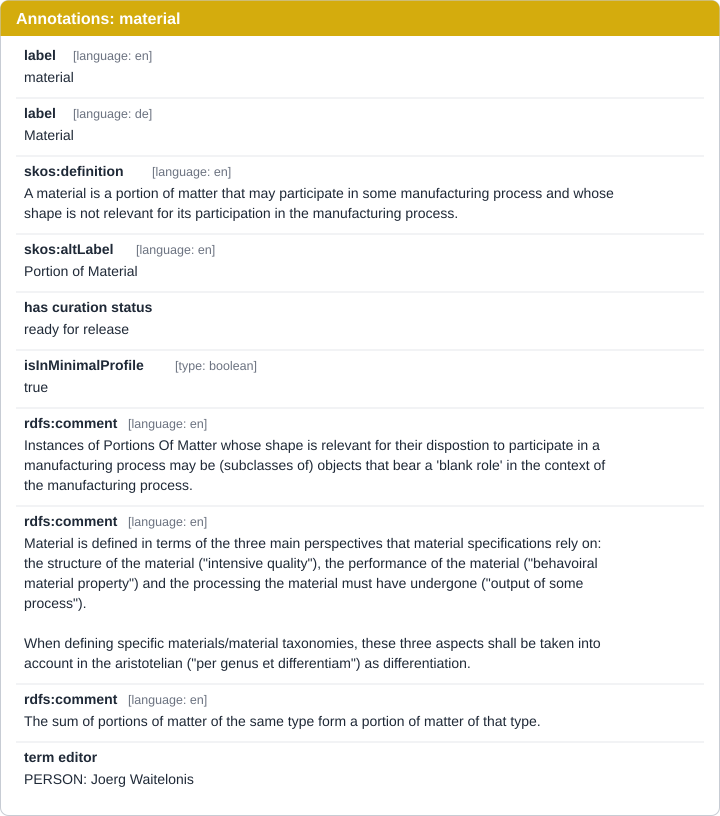
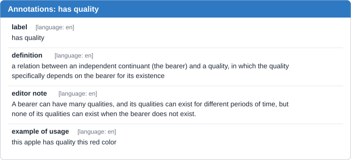

# Ontology Structure
<!--@Document_indicator: Text,links -->

## Modularization
Modules in ontology are formally defined, self-contained, and reusable fragments of an ontology that represent specific conceptual subdomains. They are engineered to support logic-based reasoning, interoperability, and tractable querying, allowing large or complex ontologies to be efficiently developed, understood, and maintained by dividing them into coherent, manageable parts. These modules make it possible to approach ontology engineering in a divide-and-conquer manner, facilitating reuse and integration across different domains and applications. PMDco defines six primary modules central to MSE, naming material, material qualities, material manufacturing, material characterization, data transformation, and devices. 

Furthermore, in ODK-based ontology modularization, modules such as import-edit, shared, and axioms-shared play distinct roles. The import-edit module contains external ontology terms and their logical extensions, supporting controlled editing and updates without manual changes to the imported content. The shared module aggregates terms or patterns that must be reused across different ontology parts, promoting interoperability between collections. The axioms-shared module collects logical axioms that are common and essential for reasoning across modules, ensuring consistency and coordination within the ontology system. As seen in below figure, PMDco is eventually created by unifying all mentioned ontology modules.

 
PMDco V3.x.x modularization

In a modularized ontology, key concepts such as classes and object properties are organized into distinct modules that capture specific domains or subdomains. Each module contains related classes, which denote the core concepts of the domain, along with their corresponding object properties, which describe relationships between these concepts and other entities. This structure allows for targeted development and maintenance, where groups of interrelated classes and properties can be managed, reused, and evolved independently while supporting interoperability through well-defined module boundaries. 

The complete list of PMDco classes, object properties, data properties, annotation properties and individuals can be found in the [Widoco](https://materialdigital.github.io/core-ontology/) documentation page. 

The following section provide example concepts related to different ontology modules.

## Classes

The class names below are the ontology's own labels, and each definition is taken from the ontology. The interactive tree at the start of each module lists all classes of that module. Greyed entries are superclasses from other modules, shown for context. The figure after it highlights the main branches, and **bold** marks PMDco classes.

**1. Materials module**
<!--@module_indicator:https://raw.githubusercontent.com/materialdigital/core-ontology/refs/heads/main/src/ontology/components/pmdco-materials.owl -->
This category includes fundamental entities that represent physical materials, independent of their shape, and their compositional relationships.

Examples:

``bfo:material entity`` – the BFO superclass of all materials and objects: an independent continuant that has some portion of matter as continuant part.

``chebi:chemical entity`` – imported from ChEBI: a physical entity of interest in chemistry, including molecular entities, parts thereof, and chemical substances.

``pmd:connected material entity aggregate`` – An object aggregate that is a mereological sum of separate material entities, which adhere to one another through chemical bonds or physical junctions that go beyond gravity.  
Examples: the atoms of a molecule, the molecules forming the membrane of a cell, the epidermis in a human body.

``pmd:disconnected material entity aggregate`` – An object aggregate that is a mereological sum of scattered (i.e. spatially separated) material entities, which do not adhere to one another through chemical bonds or physical junctions but, instead, relate to one another merely on grounds of metric proximity. The material entities are separated from one another through space or through other material entities that do not belong to the group.  
Examples: a heap of stones, a colony of honeybees, a group of synapses.

``pmd:material`` – A portion of matter that may participate in some manufacturing process and whose shape is not relevant for its participation in the manufacturing process.

Some concrete material definitions:

``pmd:metal`` – A material characterized by high electrical and thermal conductivity, ductility, and metallic bonding.

``pmd:ceramic`` – A non-metallic, inorganic material characterized by high hardness, brittleness, and heat resistance, commonly used in engineering applications.

**2. Qualities module**
<!--@module_indicator:https://raw.githubusercontent.com/materialdigital/core-ontology/refs/heads/main/src/ontology/components/pmdco-qualities.owl-->

Material qualities define the intrinsic and extrinsic properties of materials that determine their behavior and usability in various applications.

Main BFO superclasses:

``bfo:quality`` – A specifically dependent continuant that, in contrast to roles and dispositions, does not require any further process in order to be realized.

``bfo:realizable entity`` – A specifically dependent continuant that inheres in some independent continuant which is not a spatial region, and which is of a type some instances of which are realized in processes of a correlated type.

PMDco collects both kinds under one class and then classifies them in two complementary ways:

``pmd:property`` – A collection class for entities that are either qualities (they represent a state) or realizable entities (they represent a behavior). Its subclasses group properties by domain, e.g. acoustic, chemical, electromagnetic, optical, thermodynamic, manufacturing and characteristic material properties.

``pmd:characteristic material property`` – A property that is commonly associated with the domain of materials science and engineering.

  - Examples:

  - ``pmd:hardness`` – A mechanical property used as a measure of a material's resistance to localized plastic deformation, often tested by indentation or scratch methods.

  - ``pmd:chemical composition`` (a ``pmd:composition``) – An intensive quality of a portion of matter which describes the types and proportions of pure chemical elements in the portion of matter; it is the subject of some chemical composition data item.

``pmd:facetted property`` – A specifically dependent continuant that gives more detail about another property or about its bearer.

  - Examples:

  - ``pmd:extensive property`` – A facetted property that is characteristic of some object, object aggregate or fiat object part and that changes with the bearer's makeup.

  - ``pmd:intensive property`` – A facetted property that is characteristic of some portion of matter or chemical substance.

``pmd:fundamental quality of system`` – A quality that every system made of demarcated material entities has.

  - Example: ``pmd:mass`` – Mass is a fundamental extensive quality.

**3. Manufacturing module**
<!--@module_indicator:https://raw.githubusercontent.com/materialdigital/core-ontology/refs/heads/main/src/ontology/components/pmdco-manufacturing.owl-->
This category encompasses various processes and devices involved in the transformation of raw materials into finished products or components.

The superclass for industrial processes:

``pmd:manufacturing process`` – A planned process that is driven by the primary intent to transform objects. A manufacturing process is always a transformative process.

More specific examples:

``pmd:coating`` – A manufacturing process that aims to deposit a permanently adhering layer of a material without a form onto a workpiece, whereby the immediate state of the coating material directly before application is essential.

``pmd:forming`` – A manufacturing process that changes the shape of a solid body through plastic deformation while retaining both mass and structural integrity.

``pmd:joining`` – A manufacturing process that enables the continuous bonding or joining of two or more workpieces with a specific, fixed shape or of such workpieces with a shapeless material, whereby the cohesion is created at specific points and reinforced overall.

**4. Material characterization module**
<!--@module_indicator:https://raw.githubusercontent.com/materialdigital/core-ontology/refs/heads/main/src/ontology/components/pmdco-characterization.owl-->
Material characterization involves methods and devices used to analyze the physical, mechanical, and chemical properties of materials.

Main BFO superclass:

``bfo:process`` – An occurrent that has some temporal proper part and for some time t has some material entity as participant.

The superclass for characterization processes:

``obi:assay`` – A planned process that has the objective to produce information about a material entity (the evaluant) by examining it.

More specific examples:

``pmd:acoustical property analyzing process`` – An assay that measures the acoustic properties of materials by analyzing how sound waves interact with the material. This process involves generating sound waves and observing their reflection, transmission, absorption, or scattering to determine properties such as acoustic impedance, absorption coefficient, and sound speed.

``pmd:mechanical property analyzing process`` – An assay that evaluates the mechanical characteristics of materials, such as strength, hardness, elasticity, and tensile properties, often through tests that measure response to forces and loads.

``pmd:tensile testing process`` – A mechanical property analyzing process that determines a material's response to tensile forces, measuring its tensile strength, elongation, and Young's modulus.

**5. Data transformation module**
<!--@module_indicator: https://raw.githubusercontent.com/materialdigital/core-ontology/refs/heads/main/src/ontology/components/pmdco-datatransformation.owl-->
This category includes processes that involve computational simulations and digital transformations related to material properties and behaviors.

``pmd:computing process`` – A process that involves the systematic use of computational methods and tools to perform simulations, analyses, or data transformations to achieve specific scientific or engineering goals.

``pmd:simulation process`` – A computing process that models the behavior of a system over time using mathematical or computational techniques.

``pmd:monte carlo simulation`` – A simulation process that uses random sampling to solve physical and mathematical problems.

**6. Devices module**
<!--@module_indicator: https://raw.githubusercontent.com/materialdigital/core-ontology/refs/heads/main/src/ontology/components/pmdco-devices.owl-->
This category includes devices performing certain functions in industrial processes.

Main BFO superclass:

``bfo:object`` – A material entity which manifests causal unity and is of a type instances of which are maximal relative to the sort of causal unity manifested.

Examples:

``pmd:device`` – An object that is designed to perform a specific function or task involving measurement, manipulation, processing, or analysis.

``pmd:furnace`` – A device that generates and contains high-intensity thermal energy within an insulated enclosure.

``pmd:creep testing machine`` – A device used to test the creep behavior of materials under constant stress at high temperatures.

## Object Properties
<!--@property_indicator: object -->
Most PMDco object properties are reused from BFO, RO, IAO and OBI. PMDco adds its own properties for more specific MSE relations. These are shown in **bold** in the figure below, which shows the top of the object property hierarchy with some branches expanded. The interactive tree above lists every object property. Some examples:

``bfo:realizes`` – A relation between a process b and a realizable entity c such that c inheres in some d, and for all t, if b has participant d then c exists, and the type instantiated by b is correlated with the type instantiated by c.

``ro:concretizes`` – A relationship between a specifically dependent continuant or process and a generically dependent continuant, in which the generically dependent continuant depends on some independent continuant in virtue of the fact that the specifically dependent continuant or process also depends on that same independent continuant. Multiple specifically dependent continuants or processes can concretize the same generically dependent continuant.

``iao:denotes`` – A primitive, instance-level, relation obtaining between an information content entity and some portion of reality. Denotation is what happens when someone creates an information content entity E in order to specifically refer to something. The only relation between E and the thing is that E can be used to 'pick out' the thing. This relation connects those two together.

``obi:has value specification`` – A relation between an information content entity and a value specification that specifies its value.

``pmd:has state`` – Relates an anchor continuant to a temporally qualified continuant that represents a specific temporal phase of its existence.

``pmd:changes quality`` – Indicates that a process changes a quality.

``pmd:responds with`` – The realizable entity must be "stimulated" by some stimulus in order to respond with the response. The bearer of the realizable entity must participate in the stimulation as well as in the response.

PMDco uses the following constraints and rules to keep the ontology logically consistent and to support accurate data representation:
-	**Property characteristics**: Characteristics define how a property behaves in reasoning. A property can be functional (each individual has at most one value for it), inverse functional (each value points to at most one individual), transitive (chains of relationships infer new ones), symmetric (the relationship holds in both directions), asymmetric (it never reverses), reflexive (every individual relates to itself) or irreflexive (no individual relates to itself). In PMDco, for example, ``bfo:has part`` and ``bfo:part of`` are transitive, ``ro:simultaneous with`` is symmetric, ``bfo:history of`` is functional and inverse functional, and ``ro:has member`` is irreflexive.
-	**Restrictions**: Class axioms restrict how a property is used with a class. For example, a ``pmd:manufacturing process`` has specified input *some* ``bfo:object`` or ``bfo:object aggregate`` (an existential restriction), and a ``pmd:elemental crystal`` has member *exactly 1* ``pmd:portion of pure chemical element`` (a cardinality restriction).
-	**Domain and Range Specifications**: Define the classes a property applies to. For example, ``bfo:realizes`` has the domain ``bfo:process`` and the range ``bfo:realizable entity``, and ``pmd:changes quality`` has the domain ``bfo:process`` and the range ``bfo:quality``.

## Data Properties
<!--@property_indicator: data -->
``obi:has specified value`` – A relation between a value specification and a literal.

``obi:has specified numeric value`` – A relation between a value specification and a number that quantifies it.

``pmd:has value`` – A data property that relates an information content entity to a literal.

## Annotation properties
<!--@property_indicator: annotation -->
PMDco employs annotations to enrich classes and properties with metadata and human readable information, enhancing clarity and usability. This information may be provided in different natural languages (e.g., English and German).

- **Labels** | ***rdfs:label***: Provide human-readable names for ontology elements.
- **Synonyms** | ***skos:altLabel***: Provide alternative names under which a term is also known.
- **Comments** | ***rdfs:comment***: Offer detailed descriptions, usage notes, clarifications of definitions, or additional relevant information. They may enhance the understanding of the terms regarded.
- **Definitions** | ***skos:definition***: Deliver formal, human readable explanations and descriptions of classes and properties. Preferably, [Aristotelian definitions](#aristotelian-definition) are used, which help to find subclass relationships.
- **Definition Source** | ***obo:IAO_0000119***: If the definition was obtained from a specific source (e.g., a well-known work from the field of MSE, a dictionary, or a URI/URL), this is specified as definition source, also citing the original document.

As examples, the figures below show the annotations of the ``pmd:material`` class and of the ``ro:has quality`` object property:

-	Note that, for providing the definitions in PMDcore ontology we follow the [Aristotelian](https://www.merriam-webster.com/dictionary/Aristotelian) principle. An Aristotelian definition typically refers to defining something by its genus (general category) and differentia (specific characteristics that distinguish it from other members of the same genus), which should be expressed in the concepts defined in the ontology.

## Individuals
PMDco is a mid-level ontology. It gives users a framework for creating the individuals relevant to their own domain and contains almost no individuals itself. The few it does contain are:

- ``pmd:avogadro number`` – an ``obi:scalar value specification`` for the Avogadro number.
- Units reused from UO and QUDT: ``uo:mass percentage``, ``uo:mass volume percentage``, ``uo:mole fraction`` and ``qudt:PER-MOL``.

The individuals of earlier versions (aggregate state values, 3D Bravais lattices and metallic grain structures) are obsolete; see [Term Obsoletion](obsolete-ontology-terms.html).
