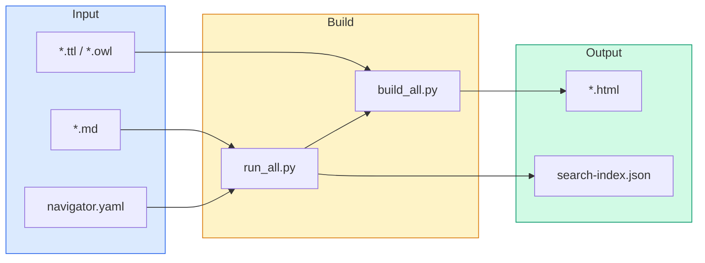
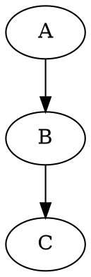
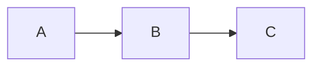
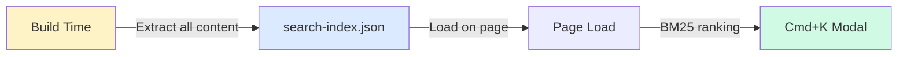

# PMDco Documentation Builder

**Transform Markdown into stunning, interactive documentation with ontology visualization.**

```
Markdown + TTL/OWL  ──▶  Interactive HTML Documentation
```

---

## What It Does

| Feature | Description |
|---------|-------------|
| **Ontology Trees** | Auto-generate expandable class hierarchies from OWL files |
| **Graph Diagrams** | Render TTL/SHACL as interactive Graphviz diagrams |
| **Full-Text Search** | Cross-page search with relevance ranking |
| **Dark/Light Themes** | Auto-detects system preference |
| **Zero Config** | Define pages in YAML, run one command |

---

## Quick Start

```bash
# Install dependencies
pip install markdown2 pyyaml rdflib

# Build everything
cd docs/docs_HTML/scripts
python run_all.py

# Output: docs/docs_HTML/HTML_Docs/
```

---

## Architecture



---

## Project Structure

```
docs/
├── navigator.yaml          ← Site structure (sections, pages, icons)
├── Logo.svg                ← Auto-copied to output
├── *.md                    ← Your documentation
│
└── docs_HTML/
    ├── scripts/
    │   ├── run_all.py      ← Entry point (batch build)
    │   ├── build_all.py    ← Page builder (core engine)
    │   └── ttl_to_graphviz.py
    │
    └── HTML_Docs/          ← Generated site
        ├── *.html
        └── search-index.json
```

---

## Navigator Configuration

The `navigator.yaml` file defines your entire site structure.

### Minimal Example

```yaml
schema: "pmdco-nav/v1"

sections:
  - id: getting-started
    title: "Getting Started"
    pages:
      - title: Home
        href: index.html
        md: index.md
        icon: home

      - title: Introduction
        href: intro.html
        md: intro.md
        icon: info
```

### Add a New Page

```yaml
# 1. Add to existing section
sections:
  - id: guides
    title: "Guides"
    pages:
      - title: My New Guide      # ← Display name
        href: my-guide.html      # ← Output file
        md: my-guide.md          # ← Source file
        icon: book               # ← Sidebar icon
```

```bash
# 2. Create the markdown file
echo "# My New Guide" > docs/my-guide.md

# 3. Rebuild
python run_all.py
```

### Add a New Section

```yaml
sections:
  # ... existing sections ...

  - id: tutorials           # Unique ID
    title: "Tutorials"      # Sidebar heading
    icon: zap               # Section icon
    pages:
      - title: Quick Start
        href: quickstart.html
        md: quickstart.md
```

---

## Markdown Tags

Special HTML comments trigger dynamic content generation during build.

### `@Graphviz_renderer` — TTL to Interactive Diagram

Converts Turtle/SHACL files into pan-zoom-export graph viewers with three hierarchy views.

```markdown
<!--@Graphviz_renderer:URL_OR_PATH-->
```

**Hierarchy Views:**

Each diagram automatically includes three switchable views via toggle buttons:

| View | Description |
|------|-------------|
| **Full** | Complete class hierarchy from the PMD core ontology |
| **Upper** | One superclass level above each class |
| **File** | File content only — no hierarchy expansion |

Users can switch between views using the **Full / Upper / File** toggle buttons in the diagram header. The same toggle is available in fullscreen mode.

**Supported Input Types:**

| Type | Extension | What It Renders |
|------|-----------|-----------------|
| SHACL Shapes | `.ttl` | Constraint graphs with node shapes |
| RDF Data | `.ttl`, `.rdf` | Instance data relationships |
| OWL Ontology | `.owl`, `.ttl` | Class hierarchies and properties |

**Example:**

```markdown
## Process Pattern

<!--@Graphviz_renderer:https://raw.githubusercontent.com/materialdigital/core-ontology/main/patterns/process/shape-data.ttl-->
```

**Generated Features:**
- Mouse wheel zoom / drag to pan
- Click nodes for URI tooltips
- Export as SVG or PNG
- Fullscreen mode

---

### `@module_indicator` — Class Hierarchy Tree

Fetches an OWL file and renders an expandable class tree.

```markdown
<!--@module_indicator:URL_TO_OWL-->
```

**Example:**

```markdown
## BFO Classes

<!--@module_indicator:https://raw.githubusercontent.com/materialdigital/core-ontology/main/src/ontology/modules/bfo_module.owl-->
```

---

### `@property_indicator` — Property Trees

Renders property hierarchies by type.

```markdown
<!--@property_indicator:TYPE-->
```

| Type | Shows |
|------|-------|
| `object` | Relationships between entities |
| `data` | Literal value attributes |
| `annotation` | Metadata (labels, comments) |

**Example:**

```markdown
## Object Properties
<!--@property_indicator:object-->

## Data Properties
<!--@property_indicator:data-->
```

---

### `@Graphviz_renderer_manual` — Inline DOT Diagrams

Embed DOT code directly in markdown.

```markdown
<!--@Graphviz_renderer_manual:Title-->

```

---

### `@Mermaid_renderer_manual` — Inline Mermaid Diagrams

Embed Mermaid diagrams directly.

```markdown
<!--@Mermaid_renderer_manual:Flow-->

```

---

### `@md_file_renderer` — Remote Markdown

Pull markdown from external URLs.

```markdown
<!--@md_file_renderer:https://raw.githubusercontent.com/org/repo/main/docs/section.md-->
```

---

### `@source_code_renderer` — Code Files

Inject syntax-highlighted code from URLs.

```markdown
<!--@source_code_renderer:https://example.org/sample.ttl-->
```

Auto-detects language from extension (`.ttl`, `.py`, `.json`, etc.)

---

## Tag Quick Reference

| Tag | Input | Output |
|-----|-------|--------|
| `@Graphviz_renderer` | TTL/OWL URL | Interactive graph |
| `@module_indicator` | OWL URL | Class tree |
| `@property_indicator` | `object`/`data`/`annotation` | Property tree |
| `@Graphviz_renderer_manual` | DOT code block | Interactive graph |
| `@Mermaid_renderer_manual` | Mermaid code block | Rendered diagram |
| `@md_file_renderer` | Markdown URL | Inline content |
| `@source_code_renderer` | Code file URL | Syntax-highlighted block |

---

## Search System



**Features:**
- Full-text across all pages
- Deep links to specific sections
- Phrase search: `"exact phrase"`
- Type filter: `type:graph`
- Section filter: `section:patterns`

**Shortcuts:** `Cmd/Ctrl + K` to open, `↑↓` to navigate, `Enter` to go

---

## CLI Reference

### Build All Pages

```bash
python run_all.py
```

### Build Single Page

```bash
python build_all.py \
    -m "../../patterns.md" \
    -o "../HTML_Docs/patterns.html" \
    --diagrams-root "../../"
```

### Options

| Flag | Description |
|------|-------------|
| `-m, --markdown` | Source markdown file |
| `-o, --out` | Output HTML file |
| `--diagrams-root` | Base path for TTL files |
| `--mode` | `docs`, `patterns`, or `auto` |
| `--no-strict` | Skip missing diagrams |
| `-q, --quiet` | Suppress output |

---

## Troubleshooting

| Problem | Solution |
|---------|----------|
| `ModuleNotFoundError` | `pip install markdown2 pyyaml rdflib` |
| Diagrams not rendering | Check TTL URL is accessible |
| Search not working | Serve via HTTP, not `file://` |
| Empty ontology trees | Verify OWL URL returns valid RDF |

---

## Links

| | |
|---|---|
| **MaterialDigital** | [materialdigital.de](https://materialdigital.de/) |
| **Repository** | [github.com/materialdigital/core-ontology](https://github.com/materialdigital/core-ontology) |
| **Documentation** | [materialdigital.github.io/core-ontology](https://materialdigital.github.io/core-ontology) |
| **License** | [CC BY 4.0](https://creativecommons.org/licenses/by/4.0/) |

---

<sub>Built for the Platform MaterialDigital (PMD) project. Funded by BMBF.</sub>
