# Manual Diagram Examples
<!--@Document_indicator: Text, Diagrams, Examples -->

This page demonstrates the manual diagram embedding feature for PMDco documentation. Use these examples as templates for creating your own diagrams using `@Graphviz_renderer_manual` and `@Mermaid_renderer_manual` tags.

## Quick Reference

### Graphviz (DOT) Syntax

To embed a Graphviz diagram, use this format:

```text
<​!--@Graphviz_renderer_manual: Your Diagram Title -->
```​dot
digraph G {
    // Your DOT code here
}
```​
```

### Mermaid Syntax

To embed a Mermaid diagram, use this format:

```text
<​!--@Mermaid_renderer_manual: Your Diagram Title -->
```​mermaid
graph TD
    // Your Mermaid code here
```​
```

---

## Basic Examples

### Simple Class Hierarchy (Graphviz)

A minimal example showing class inheritance with color-coded ontology prefixes:

<!--@Graphviz_renderer_manual: Simple Class Hierarchy -->
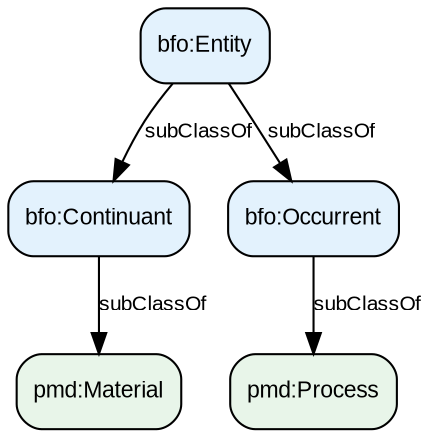

### Simple Flowchart (Mermaid)

A basic flowchart showing a linear process:

<!--@Mermaid_renderer_manual: Simple Flowchart -->
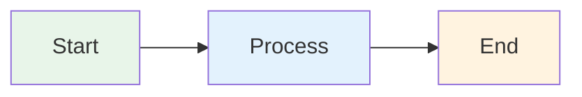

---

## Intermediate Examples

### PMDco Class Hierarchy with Properties

This example shows class relationships with object properties:

<!--@Graphviz_renderer_manual: PMDco Class Hierarchy with Properties -->
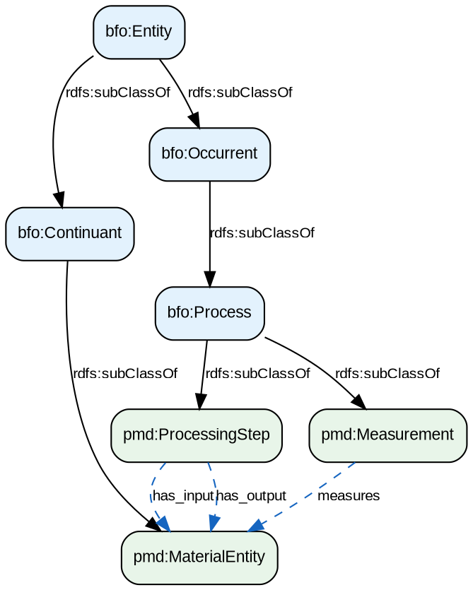

### Data Processing Workflow (Mermaid)

A workflow diagram with subgraphs and conditional logic:

<!--@Mermaid_renderer_manual: Data Processing Workflow -->
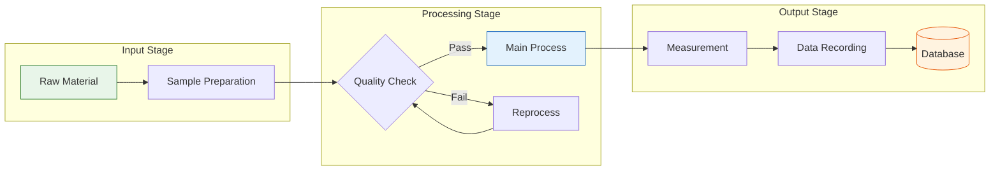

### Ontology Concept Relationships (Mermaid)

Entity relationship diagram style:

<!--@Mermaid_renderer_manual: Ontology Concept Relationships -->
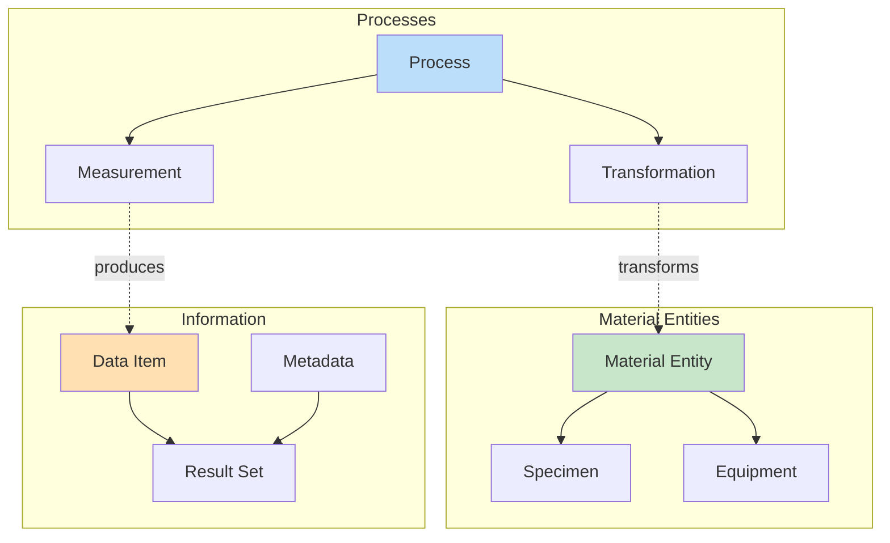

---

## Complex Examples

### Full Ontology Pattern: Temporal Regions

This complex example shows temporal relationships in BFO:

<!--@Graphviz_renderer_manual: BFO Temporal Region Pattern -->
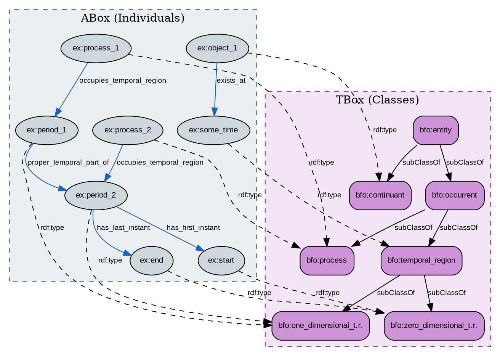

### Process Chain Pattern

A complex process with parallel and sequential steps:

<!--@Graphviz_renderer_manual: Process Chain Pattern -->
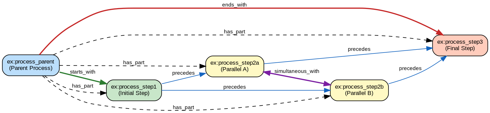

### Measurement Pattern (Mermaid)

A comprehensive measurement workflow:

<!--@Mermaid_renderer_manual: Measurement Workflow Pattern -->
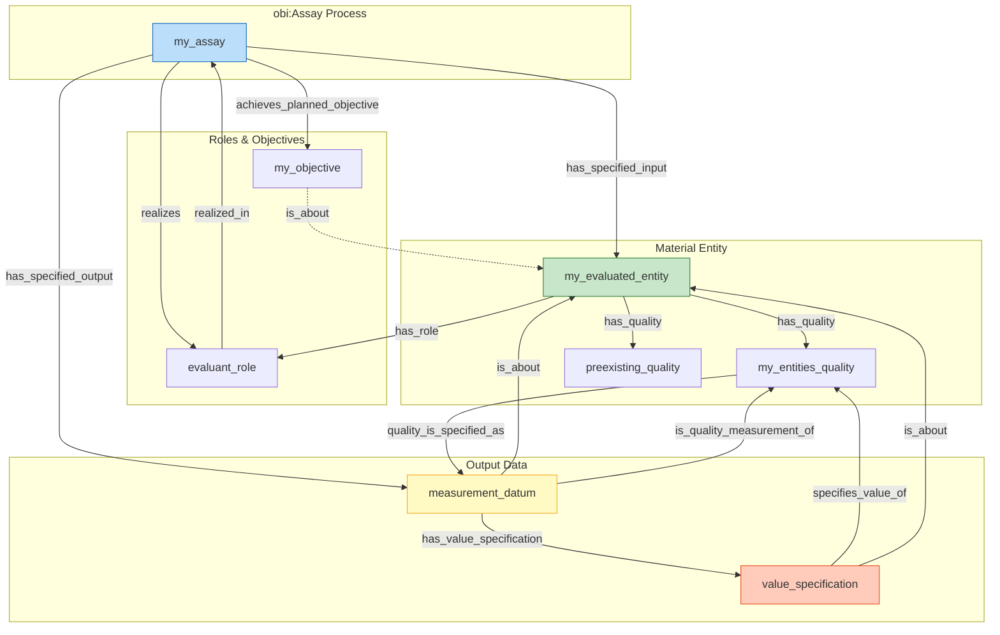

### Input/Output with Role Patterns

Complex pattern showing inputs, outputs, and role realization:

<!--@Graphviz_renderer_manual: Process Input Output with Roles -->
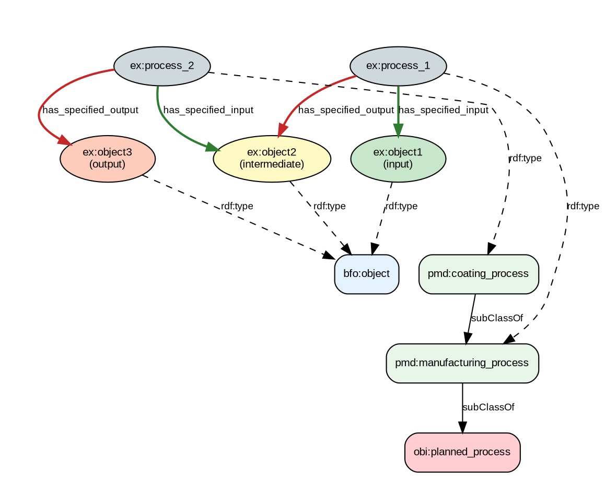

---

## Edge Cases and Special Examples

### Unicode and Special Characters

Testing special characters in labels:

<!--@Graphviz_renderer_manual: Unicode and Special Characters -->
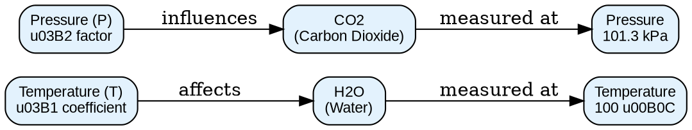

### Complex Mermaid State Diagram

State machine for material processing:

<!--@Mermaid_renderer_manual: Material Processing State Machine -->
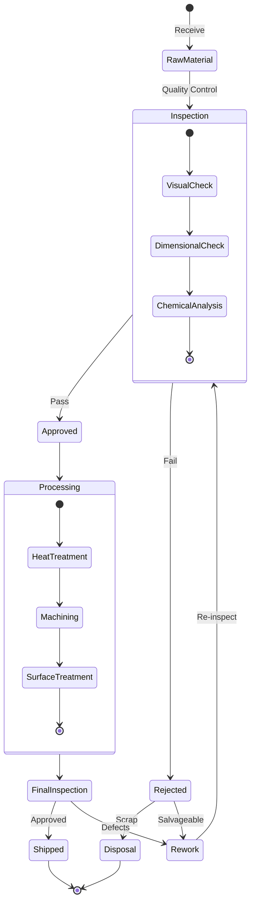

### Sequence Diagram for Measurement Process

<!--@Mermaid_renderer_manual: Measurement Process Sequence -->
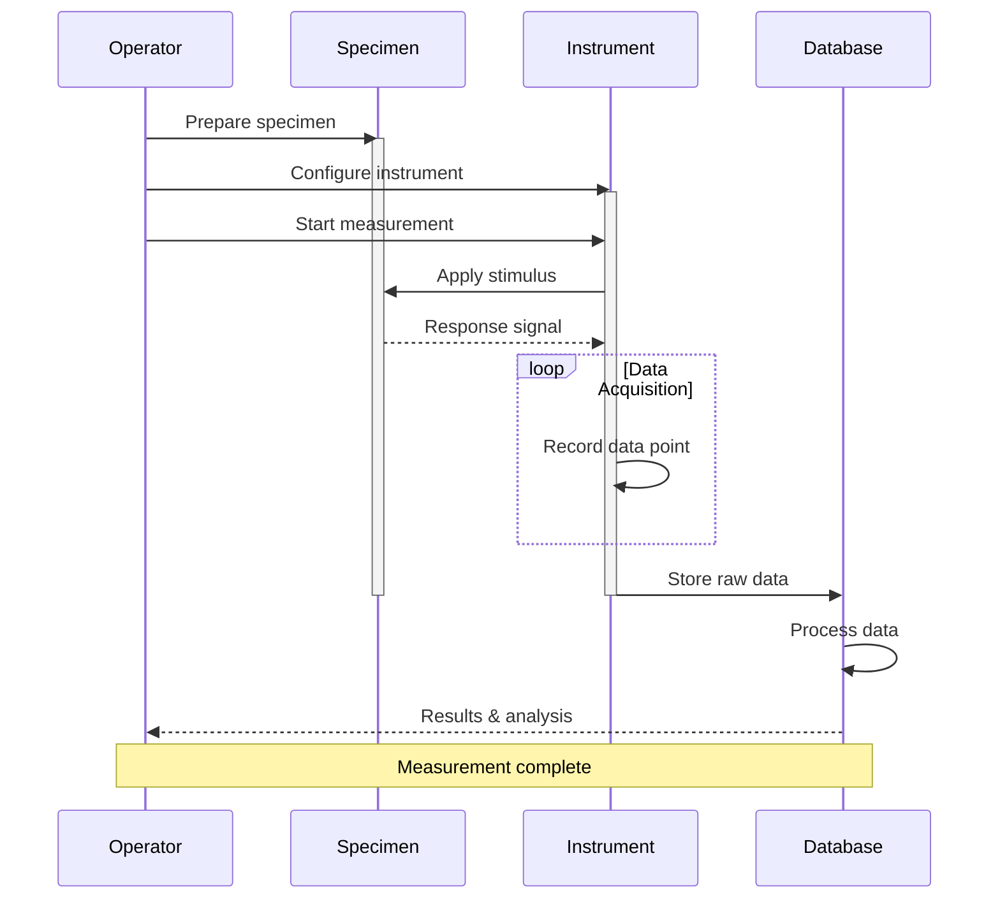

### Large Graph with Clusters

Demonstrating graph organization with subgraphs:

<!--@Graphviz_renderer_manual: Clustered Ontology Overview -->
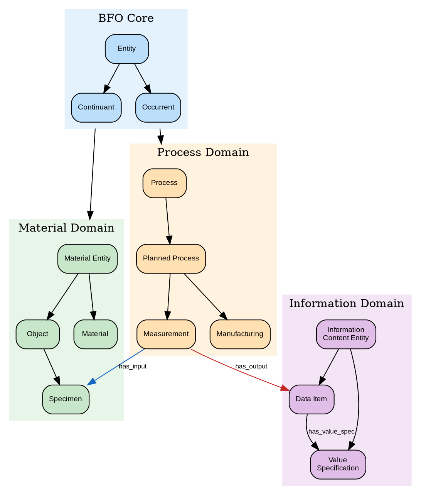

### Class Diagram Style (Mermaid)

UML-style class diagram:

<!--@Mermaid_renderer_manual: UML Class Diagram Style -->
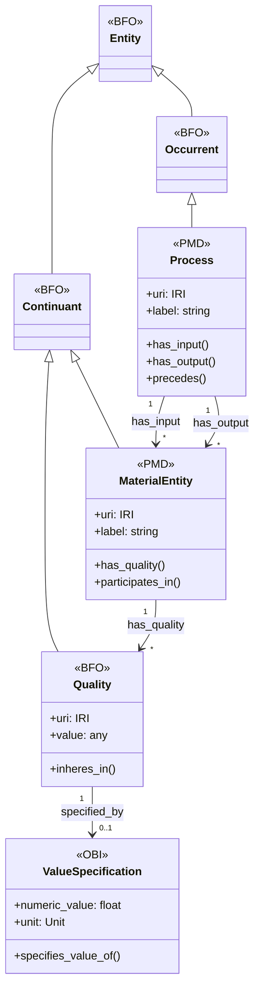

---

## Styling Reference

### Graphviz Color Palette

Use these colors for consistent ontology visualization:

| Ontology | Fill Color | Hex Code |
|----------|------------|----------|
| BFO | Light Blue | `#E3F2FD` |
| PMD | Light Green | `#E8F5E9` |
| OBI | Light Red | `#FFEBEE` |
| IAO | Light Purple | `#F3E5F5` |
| Individual | Light Grey | `#CFD8DC` |

### Common Graphviz Node Styles

```dot
// Class node (box)
Node [shape=box, style="rounded,filled", fillcolor="#E3F2FD"];

// Individual node (ellipse)
Node [shape=ellipse, style=filled, fillcolor="#CFD8DC"];

// Literal/Value node (note shape)
Node [shape=note, style=filled, fillcolor="#FFF9C4"];
```

### Common Edge Styles

```dot
// Subclass relationship (solid)
A -> B [label="rdfs:subClassOf"];

// Type relationship (dashed)
A -> B [style=dashed, label="rdf:type"];

// Object property (colored)
A -> B [label="has_part", color="#1565C0"];

// Bidirectional
A -> B [dir=both, label="related_to"];
```

---

## Tips and Best Practices

1. **Use meaningful IDs**: Diagram IDs are generated from titles, so use descriptive titles
2. **Keep diagrams focused**: One concept per diagram is easier to understand
3. **Use consistent colors**: Stick to the ontology color palette above
4. **Add labels**: Always label edges with property names
5. **Use clusters**: Group related nodes in subgraphs for complex diagrams
6. **Test rendering**: Build the page locally to verify diagram rendering
7. **Escape special characters**: Use `\n` for newlines in labels

### Common Issues

- **Diagram not rendering**: Check that the code block language is `dot` or `mermaid`
- **Missing title**: Ensure the tag has a title after the colon
- **Broken layout**: Try adjusting `rankdir` (TB, BT, LR, RL)
- **Text overflow**: Use `\n` to break long labels into multiple lines
