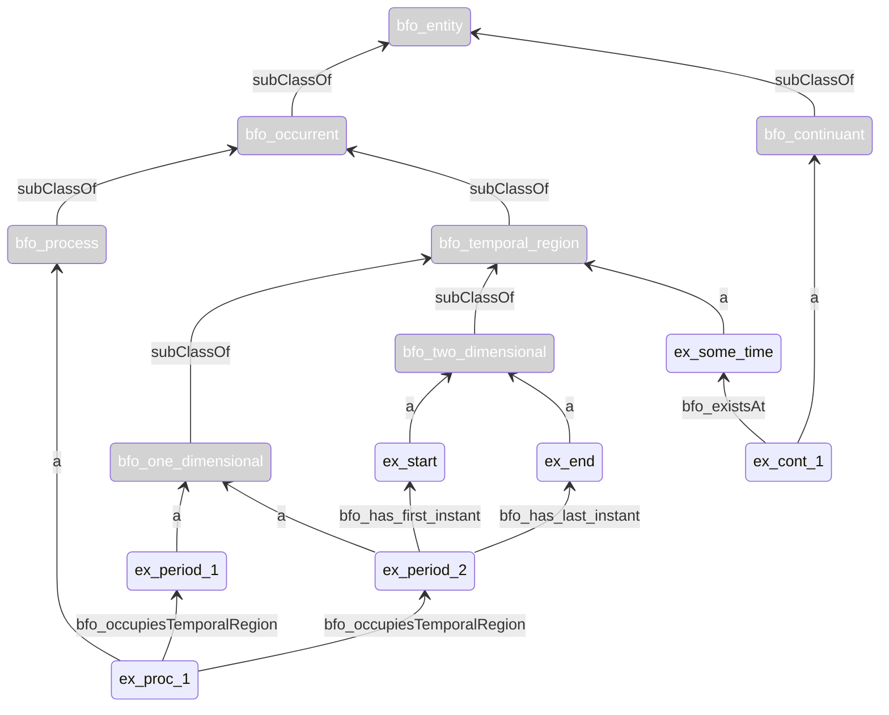

# Usage Patterns

In ontology development and usage, **usage patterns** play a critical role in addressing recurring modeling requirements. These patterns provide standardized, reusable semantic snippets that facilitate consistent representation of relationships between instances and entities. Furthermore, such patterns may be used to create SHACL shapes to include constraints in a knowledge representation. By following usage patterns, ontology users and developers can ensure uniformity, clarity, and reusability in their models.

The sections below illustrate how to read and apply these patterns. Each pattern includes its purpose, description, relevant properties, visualization, and example.

---

## Table of Contents
Hereby we provide an overview of the patterns used in PMDco 3.0.0:

- [Pattern 1](#Pattern-1---Temporal-Region): Temporal Region
- [Pattern 2](#Pattern-2---Process-Chain): Process Chain
- [Pattern 3](#Pattern-3---Process-Inputs-and-Outputs): Process Inputs and Outputs
- [Pattern 4](#Pattern-4---Realizable-Entities): Realizable Entities
- [Pattern 5](#Pattern-5---Qualities): Qualities
- [Pattern 6](#Pattern-6---Scalar-Measurement): Scalar Measurement
- [Pattern 7](#Pattern-7---Scalar-Value-Specification): Scalar Value Specification
- [Pattern 8](#Pattern-8---Categorical-Value-Specification): Categorical Value Specification
- [Pattern 9](#Pattern-9---Material-and-Device-Specification): Material and Device Specification

---

## Example Patterns

### Pattern 1 - Temporal Region

- **Purpose**: Specifying the boundaries of a process on the time axis. 
- **Core Properties**: 
  - `bfo:occupies temporal region` ([BFO_0000199](http://purl.obolibrary.org/obo/BFO_0000199))
  - `bfo:proper temporal part of ` ([BFO_0000136](http://purl.obolibrary.org/obo/BFO_0000136))
  - `bfo:has first instant ` ([BFO_0000222](http://purl.obolibrary.org/obo/BFO_0000222))
  - `bfo:has last instant ` ([BFO_0000224](http://purl.obolibrary.org/obo/BFO_0000224))
  - `bfo:ends with ` ([PMD_0060003](https://w3id.org/pmd/co/PMD_0060003))
- **Example Use Case**: Specifying certain moments of time when some industrial process started or ended. 

---

### Pattern 2 - Process Chain

- **Purpose**: Represent complex processes, consisting of simultaneous and serial subprocesses. 
- **Core Properties**: 
  - `bfo:precedes` 
  - `bfo:hasOccurentPart`
  - `pmd:startsWith`
  - `pmd:endsWith`
- **Example Use Case**: Specifying the structure of commplex manufactirung processes consisting of several stages.

---

### Pattern 3 - Process Inputs and Outputs

- **Purpose**: Describes how to represent inputs and outputs for planned processes typically involving material entities or information-bearing entities.
- **Core Properties**: 
  - `pmd:hasInput` 
  - `pmd:hasOutput`
- **Example Use Case**: A planned process with possibility of multiple inputs and outputs, e.g., testing properties of a metallic sample, or transforming a piece of material into another product.

---

### Pattern 4 - Realizable Entities

- **Purpose**: Represent characteristics of the objects, brought to existence by specific situation.
- **Core Properties**: 
  - `bfo:bearerOf` 
  - `bfo:concretizes`
  - `bfo:realizes`
  - `bfo:hasParticipant`
- **Example Use Case**: Specifying the role of specimen, which material object undertakes during a process. 
  

---

### Pattern 5 - Qualities

- **Purpose**: Represent inherent characteristics of the objects, having certain scalar values at moments/periods of time.
- **Core Properties**: 
  - `bfo:bearerOf` 
  - `bfo:existAt`
  - `iao:isAbout`
  - `pmd:derivesFrom`
- **Example Use Case**: Specifying that value of hardness of a specimen at certain point of time.

---

### Pattern 6 - Scalar Measurement

- **Purpose**: Represent measured value of some material characteristic. 
- **Core Properties**: 
  - `iao:isQualityMeasuredAs` 
  - `bfo:realizes`
  - `iao:isAbout`
  - `pmd:hasInput`
  - `pmd:hasOutput`
  - `pmd:hasValueSpecification`
  - `pmd:specifiesValueOf`
- **Example Use Case**: Specifying the measured heat capacity value of a specimen.

---

### Pattern 7 - Scalar Value Specification

- **Purpose**: Represents scalar physical quantities, combining a numerical value and a unit.
- **Core Properties**: 
  - `obi:hasSpecifiedNumericValue`
  - `iao:hasMeasurementUnitLabel`
  - `pmd:hasValueSpecification`
  - `pmd:specifiesValueOf`
- **Example Use Case**: Specifying measurements like length, mass, or time with standard units.

---

### Pattern 8 - Categorical Value Specification

- **Purpose**: Represents object characteristics, described by belonging to some category.
- **Core Properties**: 
  - `obi:hasSpecifiedValue`
  - `iao:isQualityMeasuredAs`
  - `pmd:hasValueSpecification`
  - `pmd:specifiesValueOf`
- **Example Use Case**: Specifying that material belongs to a certain category, e.g., is a polymer.
  

---
### Pattern 9 - Material and Device Specification

- **Purpose**: Specify the material, from which the object is made, by stating that it complies with the certain material specification. Or, specifying the device in the same manner.
- **Core Properties**: 
  - `iao:isQualityMeasuredAs`
  - `iao:isAbout`
  - `pmd:hasValueSpecification`
  - `pmd:specifiesValueOf`
- **Core Idea**: provide a class pmd:MaterialSpecification/pmd:DeviceSpecification as a subclass of iao:InformationContentEntity, to which the material/device object can adhere.
- **Example Use Case**: Specifying the material of a steel sheet to be the steel S355J2.

---
