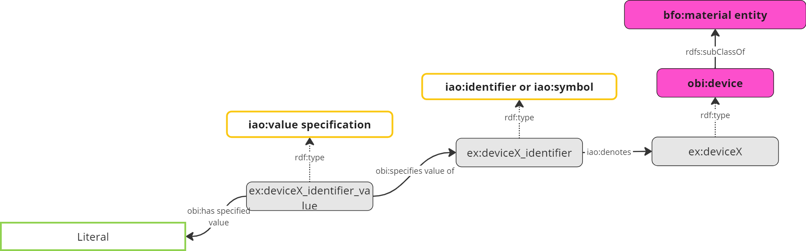

# Pattern: Device identifier
## Purpose
Each device must have at least one identifier.

## Description
To identify a device it can be denoted by instaces of type `identifier (obi:IAO_0020000)` 
or `symbol (obi:IAO_0000028)`. The value of this identifier is provided by a value specification.

## Visualization
The following image shows a device which is described by an . 

alternative Visualization using [visgraph](https://thhanke.github.io/visgraph/?rdfUrl=https://raw.githubusercontent.com/materialdigital/core-ontology/main/patterns/device%20identfier/shape-data.ttl)

   
## Shapes and example data
[shape-data.ttl](shape-data.ttl)

[shape.ttl](shape.ttl)

