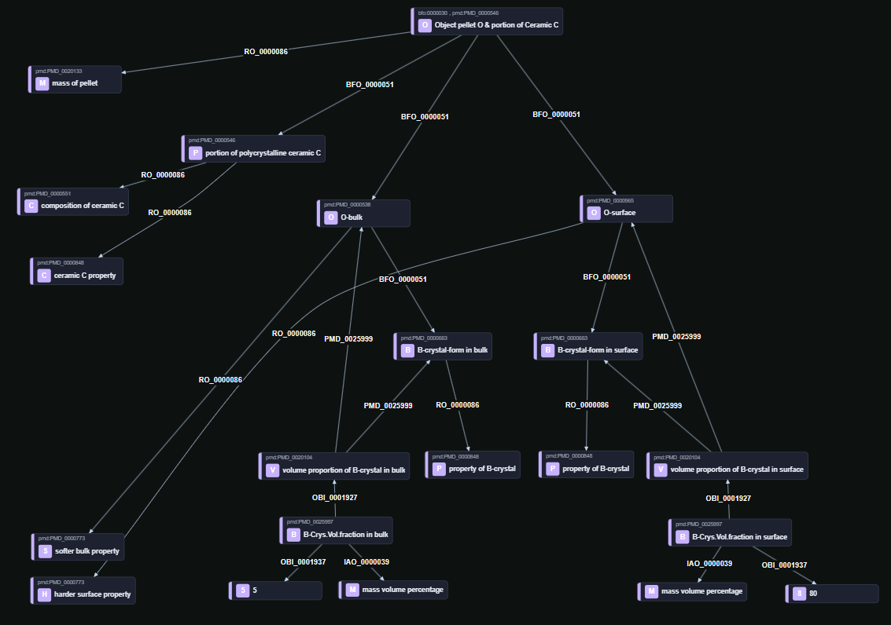

# Pattern: Different qualities in object, matter, and microstructure

## Purpose

This pattern shows how one entity can be modeled across three layers — object, matter, and inner structure — and how each layer can bear its own qualities.

## Description

The pattern follows the logic of Pattern 1 (“duality of object and material”) and extends it with an inner-structure layer.

The same entity is modeled both as:
- an object (`O`, a pellet object), and
- a portion of matter (`C`, a portion of polycrystalline ceramic C).

From this main entity, a polycrystalline ceramic portion is modeled. That material portion bears:
- the composition of ceramic C, and
- a generic ceramic C property.

The object has two parts:
- `O-surface`
- `O-bulk`

Each containing `B-crystal-form` portion of the same ceramic, bearing the inner-structure quality:
- `property of B-crystal`

To make the hierarchy-level distinction explicit, the pattern models:
- `volume proportion of B-crystal in O-surface` with value `80`
- `volume proportion of B-crystal in O-bulk` with value `5`

These are represented as relational qualities, because they depend on the relation between:
- the `B-crystal-form` portion, and
- the hosting region (`O-surface` / `O-bulk`).

At the object-part level, the regions bear different qualities:
- `harder surface property`
- `softer bulk property`

This shows how different qualities can be connected to different lower-level constitutions, separate from the generic qualities assigned to object and portion of matter.

## Visualization

## Shapes and example data

[shape-data.ttl](shape-data.ttl)
