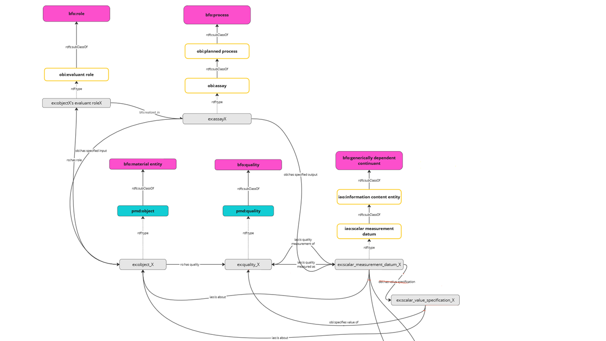

# Pattern: measurement
## Purpose
Description on how to represent the result of a measurement of a (scalar) physical quanity.

## Description
The quantification of a quality of a material entity can be achieved through a measurement. 
The measurement is performed as an assay which has an object as an input and an information 
content entity as an output. The observed object may undergo several measurements (and other
activities) and is thus related to this specific measurement through its role. 

## Visualization
The following image shows the assay "test:my_assay", in which the quality "test:my_entities_quality" is quantified by a scalar measurement datum. 

alternative Visualization using [visgraph](https://thhanke.github.io/visgraph/?rdfUrl=https://raw.githubusercontent.com/materialdigital/core-ontology/refs/heads/main/patterns/measurement/shape-data.ttl)

       
## Shapes and example data
[shape-data.ttl](shape-data.ttl)

[shape.ttl](shape.ttl)

