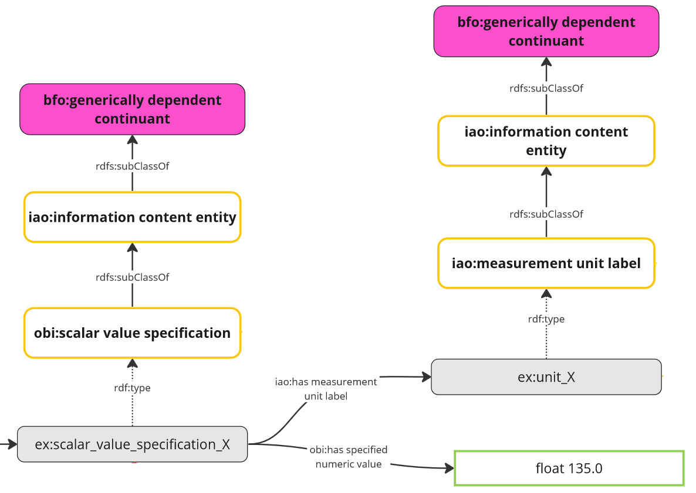

# Pattern: scalar value specification with value and unit
## Purpose
Description on how to represent scalar physical quanities with value and unit.

## Description
Typically, scalar physical quantitites will be represented by a resource with associated 
value (aka magnitude) and a unit. Units will typically be resources from external ontologies. 
A scalar physical quantity has exactly one value and exactly one unit. 
You should consider modelling the resource as a BNode.

## Visualization
The following image shows an instance of a scalar value specification with value and unit. 

          
## Shapes and example data
[shape-data.ttl](shape-data.ttl)

[shape.ttl](shape.ttl)

